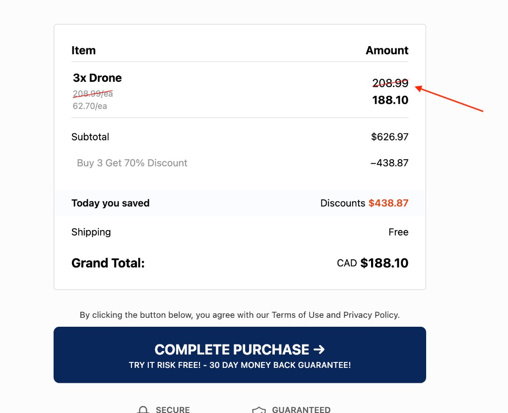

# Campaign issues overview

Shareable list of **known issues and limitations** across **whole campaigns** (checkout, summary, bumps, bundles, operators). Written for anyone following a funnel—not only engineers. Technical repro, BS ids, and migration crosswalks stay in the **[template bug log](template-bug-log.md)**.

**Status (short):**

| Label    | Meaning                                                      |
| -------- | ------------------------------------------------------------ |
| Open     | Still a problem or open request; no stable fix yet           |
| Blocked  | Waiting on platform/SDK or a firm product decision           |
| Fixed    | Addressed in templates or process; follow-up QA still useful |
| Verified | Change checked in QA; treat as resolved for that setup       |

---

## Bundle migration note (not a defect)

**Bundle quantity tiers** (`data-next-bundle-selector`, one `packageId` with 1× / 2× / 3× cards) are a **different way to structure a campaign** than the older **multi-package selector** (separate package ids per tier). **Pricing, offers, and rounding** follow the bundle / discount model in the Campaigns app — operators cannot copy the old selector playbook one-for-one.

---

Within each table, issues are listed **high → medium → low** by severity. `#` is the row id **within that table** only.

## Open and blocked

| #   | Description                                                                                                                                                                                                                                                                                          | Who it affects                                                                                                                         | Severity | Status  |
| --- | ---------------------------------------------------------------------------------------------------------------------------------------------------------------------------------------------------------------------------------------------------------------------------------------------------- | -------------------------------------------------------------------------------------------------------------------------------------- | -------- | ------- |
| 1   | **Cart summary (BS-012):** `{line.priceRetailTotal}` should be the **full-line** list/compare total (list × qty). It often repeats the **per-unit** list instead, so the **Amount** strikethrough is wrong on multi-qty or bundle lines while subtotal math can still be correct. [Example below](#bs012-cart-summary-example). | **All** campaigns using `[data-next-cart-summary]` line templates with a compare/strike column (reference `olympus-v0.4`, `olympus-mv-single-step-v0.4`). | High     | Open    |
| 2   | **Bumps + `data-next-package-sync` (BS-005 / BS-008, Known #7):** On the 0.4.x **toggle-price** path, when the bump is **synced** to the main bundle line, turning the bump **on** updates card prices to match the **current** tier. Changing **bundle tier** afterward updates **cart/summary totals** but **not** the bump’s **shown** compare/sale until the shopper **unchecks and checks** the bump again. **Desired:** toggle preview recomputes whenever synced qty / main bundle selection changes. **Template option:** keep sync for add/remove but show **stable unit list + sale** with **`data-next-display="package.price_retail"`** / **`package.price`** on the bump package (older pattern) instead of **`data-next-toggle-price`** — tradeoff vs offer-aware toggle math; see bug log. | **All** checkouts using **`data-next-package-toggle`** + **`data-next-toggle-card`** + **`data-next-toggle-price`** with **`data-next-package-sync`** (e.g. warranty on bundle tier). | Medium | Blocked |
| 3   | Per-card shipping method on bundle tiers does not behave as a supported lever; package swap selectors can still fail to update **shown** shipping and grand total even when cart state looks updated.                                                                                                | **All** bundle-tier campaigns trying per-tier shipping on cards; **all** package-swap selector campaigns for summary/total mismatch.   | Medium   | Open    |
| 4   | Showing the applied coupon code (or “has coupon”) via simple cart display hooks often stays empty; the summary layer does not resolve those fields today.                                                                                                                                            | **All** campaigns relying on those hooks in cart summary markup (reference `olympus-v0.4`, `olympus-mv-single-step-v0.4`).             | Medium   | Open    |
| 5   | Applied coupon can clear after a full browser refresh (session/hydration behavior).                                                                                                                                                                                                                  | **All** campaigns using coupons.                                                                                                       | Medium   | Open    |
| 6   | Auto-rendered bundle cards (injected from a template) do not bind product name/image the same way as inline cards; placeholders can stay blank. **Low priority:** reference templates use **inline** bundle cards instead, so this SDK path is optional—note for engineering to fix when convenient. | **All** campaigns that opt into Step 4 auto-render (`data-next-bundles` + template id); not used in default olympus-v0.4.              | Low      | Open    |
| 7   | No first-class, documented way to print “1× / 2× / 3×” (or similar) from the SDK alone; titles are usually hard-coded per card.                                                                                                                                                                      | **All** campaigns with multi-tier bundle cards.                                                                                        | Low      | Open    |
| 8   | Cart summary line amounts always include the currency symbol; layouts that show currency once still repeat the symbol on every line.                                                                                                                                                                 | **All** campaigns using cart summary line templates (e.g. reference `olympus-v0.4`, `olympus-mv-single-step-v0.4`).                    | Low      | Open    |

### Example: multi-qty line strikethrough (open issue #1, BS-012)

The cart summary **line row** template uses tokens such as `{line.priceRetail}` / `{line.total}` and often **`{line.priceRetailTotal}`** for the **right-hand “Amount”** strikethrough. For a line like **3×** the same product, **`{line.priceRetailTotal}`** is supposed to equal **full-line retail** (e.g. unit list price **× 3**). In practice it frequently resolves to the **same value as one unit’s** list price, so the strike shows **$208.99** instead of **~$626.97** even when **Subtotal** below correctly shows **3 × list**.

## Fixed and verified

| #   | Description                                                                                                                                                                                                                               | Who it affects                                                                                                                           | Severity | Status   |
| --- | ----------------------------------------------------------------------------------------------------------------------------------------------------------------------------------------------------------------------------------------- | ---------------------------------------------------------------------------------------------------------------------------------------- | -------- | -------- |
| 1   | Old pattern: several selector cards sharing one package id breaks selection and cart sync when shoppers switch tiers.                                                                                                                     | **All** campaigns still on legacy package selector with duplicate package ids. (Reference repo moved bundle flows to unique bundle ids.) | High     | Fixed    |
| 2   | Bundle tier clicks used to **add** separate cart lines instead of replacing one line; refresh could show default tier **plus** a persisted tier. **Fixed** on reference checkout (re-test passed). Re-verify after SDK or markup changes. | **All** campaigns using `data-next-bundle-selector` with tier cards.                                                                     | High     | Fixed    |
| 3   | Bare **`data-next-bundle-price`** (no `="total"`) does not reliably fill the tier total; templates must use **`data-next-bundle-price="total"`**. **Fixed** as a **markup requirement** — not an open product defect once documented. | **All** campaigns with `data-next-bundle-card` tier pricing on the card. | High | Fixed |
| 4   | Older “package.1.name” style display tokens do not resolve on bundle cards; markup must scope by package on the card.                                                                                                                     | **All** campaigns with bundle cards using that pattern.                                                                                  | Medium   | Verified |
| 5   | **Cart summary rollup (BS-010):** Cart-level **“Today you saved”** / discount totals vs per-line savings could disagree on some setups. **Resolved** when using **`data-next-bundle-selector`** with **offers and campaign structure** aligned to bundle tiers (reference `olympus-v0.4`). Legacy multi-package layouts may still need separate QA. | **Bundle-tier** funnels with correct Campaigns configuration. | Medium | Verified |

---

*Last aligned with the template bug log: BS-001–BS-014 and operator/platform notes. Update both tables and the bundle migration note when things change.*